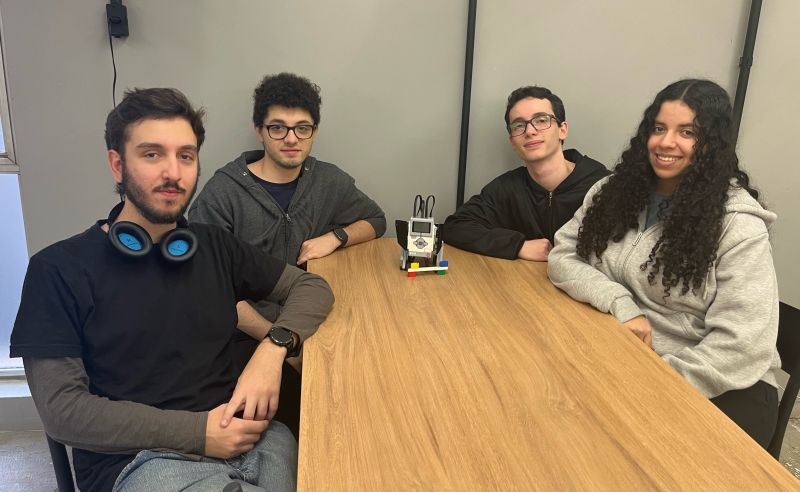

# Projeto LEGO MINDSTORMS EV3 — Puppy

Projeto da disciplina com o robô **Puppy** do LEGO MINDSTORMS EV3, programado em Python (Pybricks / EV3 MicroPython v2.0).

O cachorrinho reage a **cores** (alimentação, via sensor de cor) e a **carinho** (sensor de toque), alternando entre 8 comportamentos conforme o equilíbrio entre quantas vezes foi alimentado e acariciado.

> **Arquivo definitivo: [`puppy/mainP.py`](puppy/mainP.py)** — é a versão atual e a que deve ser enviada ao brick. Os demais `main*.py` são versões antigas, mantidas apenas como histórico (ver [Arquivos antigos](#arquivos-antigos)).

## Registro do projeto

As fotos abaixo registram a preparação do projeto, a organização das peças e a equipe com o Puppy montado:

| Kit e instruções de montagem                                                                            | Organização das peças                                                                         |
| ------------------------------------------------------------------------------------------------------- | --------------------------------------------------------------------------------------------- |
|  |  |



*Registro da montagem e da apresentação do robô Puppy.*

---

## Estrutura do repositório

```text
puppy/              → projeto EV3 (é esta pasta que vai para o brick)
  mainP.py            programa definitivo
  .vscode/            configurações da extensão EV3 do VS Code
archive/            → versões antigas, fora do projeto EV3
Materiais de Aula/  → PDFs e materiais da disciplina
*.jpeg / *.jpg      → registros fotográficos do projeto
```

| Caminho                                        | Descrição                                                                                                                 |
| ---------------------------------------------- | ------------------------------------------------------------------------------------------------------------------------- |
| [`puppy/`](puppy/)                             | Projeto EV3. Abra **esta pasta** no VS Code para usar o "Download and Run"                                                |
| [`puppy/mainP.py`](puppy/mainP.py)             | **Programa definitivo** do robô                                                                                           |
| [`puppy/.vscode/`](puppy/.vscode/)             | Configurações da extensão EV3 (o `launch.json` aponta para `mainP.py`)                                                    |
| [`archive/`](archive/)                         | Versões antigas — não usar. Ficam fora de `puppy/` para não serem enviadas ao brick ([detalhes](archive/README.md))       |
| [`Materiais de Aula/`](Materiais%20de%20Aula/) | PDFs, DOCX e PPTX da disciplina (roteiro de avaliação, configuração do ambiente, manual do EV3, template de apresentação) |
| Fotos na raiz                                  | Registros da montagem, das peças e da equipe ([galeria](#registro-do-projeto))                                            |

---

## Montagem e portas

Montagem oficial do Puppy: [instruções LEGO Education](https://education.lego.com/en-us/support/mindstorms-ev3/building-instructions#building-core).

| Porta  | Componente              | Observação                              |
| ------ | ----------------------- | --------------------------------------- |
| **A**  | Motor da perna direita  | sentido anti-horário                    |
| **D**  | Motor da perna esquerda | sentido anti-horário                    |
| **C**  | Motor da cabeça         | engrenagens `[[1, 24], [12, 36]]`       |
| **S1** | Sensor de toque         | detecta o carinho                       |
| **S4** | Sensor de cor           | detecta o "osso" colorido (alimentação) |

Ângulos de referência definidos no início da classe `Puppy`:

- Pernas: `HALF_UP_ANGLE = 25` · `STAND_UP_ANGLE = 65` · `STRETCH_ANGLE = 125`
- Cabeça: `HEAD_UP_ANGLE = 0` · `HEAD_DOWN_ANGLE = -40`

---

## 🎨 O que cada cor faz

O sensor de cor (S4) é lido em [`update_feed_count()`](puppy/mainP.py#L425-L463). Toda cor válida **conta como uma alimentação** (`feed_count += 1`) e dispara uma reação própria:

| Cor                            | Reação                                                                                                                                | Código                               |
| ------------------------------ | ------------------------------------------------------------------------------------------------------------------------------------- | ------------------------------------ |
| 🔴 **Vermelho**                 | **Come** — chama `eat()`: abaixa a cabeça (−40°), olhos apertados, som de mastigar (`CRUNCHING`), espera 500 ms e levanta a cabeça    | [L444-446](puppy/mainP.py#L444-L446) |
| 🟢 **Verde**                    | **Pede comida** — olhos de machucado (`HURT_EYES`), **senta** e chora (`DOG_WHINE`)                                                   | [L447-451](puppy/mainP.py#L447-L451) |
| 🔵 **Azul**                     | **Late** — olhos neutros (`NEUTRAL_EYES`) e latido (`DOG_BARK_2`)                                                                     | [L452-455](puppy/mainP.py#L452-L455) |
| 🟡 **Amarelo**                  | **Faz xixi** — chama `go_to_bathroom()`: fica de pé, levanta a perna esquerda até 125°, buzina (`HORN_1`), balança a perna 3× e volta | [L456-458](puppy/mainP.py#L456-L458) |
| ⚪ **Branco / marrom / demais** | Reação padrão de comer — olhos apertados + som de mastigar                                                                            | [L459-461](puppy/mainP.py#L459-L461) |
| ⚫ **Preto / nenhuma cor**      | **Ignorado.** É o que o sensor lê quando não há nada na frente — não alimenta e não reage                                             | [L437](puppy/mainP.py#L437)          |

**Importante — a cor precisa mudar.** A reação só dispara quando a cor lida é **diferente da última cor aceita** (`self.prev_color`). Para repetir a mesma reação é preciso afastar o osso e aproximar de novo, ou alternar entre duas cores.

**Detalhe do amarelo:** como `go_to_bathroom()` termina com `feed_count = 1` e `behavior = idle`, o incremento feito logo antes é sobrescrito — o amarelo efetivamente **zera o contador de comida para 1**.

**Cor também acorda o robô.** Em [`go_to_sleep()`](puppy/mainP.py#L169-L183), qualquer cor diferente de preto (ou um toque) faz o cachorrinho acordar.

---

## 🖐️ O que o carinho faz

O sensor de toque (S1) é lido em [`update_pet_count()`](puppy/mainP.py#L401-L423):

- Cada nova pressão incrementa `pet_count`.
- Se o comportamento atual **não** for `act_hungry`: olhos apertados + som de cheirar (`DOG_SNIFF`).
- Se o robô estiver **com fome**, o carinho em vez de comida o deixa **bravo** (`act_angry`).
- Durante o sono, o toque **acorda** o cachorrinho.

---

## 🐕 Comportamentos do robô

São **8 comportamentos**. O loop principal chama o comportamento atual a cada 100 ms:

| Comportamento        | O que faz                                                                                                                                    |
| -------------------- | -------------------------------------------------------------------------------------------------------------------------------------------- |
| **`idle`**           | Fica de pé, pisca os olhos e monitora carinho, comida e mudanças de estado. É o estado "neutro" e o único que decide trocar de comportamento |
| **`go_to_sleep`**    | Olhos cansados → senta → abaixa a cabeça → olhos dormindo → ronca (`SNORING`). Acorda com toque ou cor                                       |
| **`wake_up`**        | Olhos cansados, choraminga, levanta a cabeça, senta, **se espreguiça**, espera 1 s, fica de pé → volta para `idle`                           |
| **`act_playful`**    | Olhos neutros, fica de pé e **late** (`DOG_BARK_2`) em intervalos aleatórios de 4 a 8 s. Um carinho encerra a brincadeira                    |
| **`act_angry`**      | Olhos bravos, **rosna** (`DOG_GROWL`), fica de pé, espera 1,5 s, **late** (`DOG_BARK_1`) e desconta 1 do `pet_count`                         |
| **`act_hungry`**     | Olhos de machucado, **senta** e chora. Comida → volta a `idle`; carinho → fica **bravo**                                                     |
| **`go_to_bathroom`** | Olhos apertados, fica de pé, **levanta a perna esquerda**, buzina, balança a perna 3× e volta. Reinicia `feed_count` para 1                  |
| **`act_happy`**      | Olhos de coração, senta e **late + pula 3×** (`hop`), senta e chama `reset()` — recomeça o ciclo com novas metas                             |

### Ações físicas reutilizáveis

| Ação              | Descrição                                                              |
| ----------------- | ---------------------------------------------------------------------- |
| `sit_down()`      | Senta (motores das pernas para trás por 1 s)                           |
| `stand_up()`      | Fica de pé em dois estágios: 25° e depois 65°                          |
| `stretch()`       | Espreguiça — estende as pernas até 125°, choraminga e volta            |
| `hop()`           | Pula (motores a 500°/s por 275 ms)                                     |
| `move_head(alvo)` | Move a cabeça para o ângulo alvo                                       |
| `eat()`           | Abaixa a cabeça, mastiga e levanta                                     |
| `adjust_head()`   | Calibração inicial da cabeça pelos botões do brick                     |
| `update_eyes()`   | Anima os olhos (piscadas e olhadas para os lados) enquanto está `idle` |

---

## ⚙️ Como o robô decide o que fazer

Dois contadores controlam tudo: **`pet_count`** (carinhos) e **`feed_count`** (alimentações). A cada `reset()`, o programa sorteia novas metas:

- `pet_target` = número aleatório entre **3 e 6**
- `feed_target` = número aleatório entre **2 e 4**
- Ambos os contadores começam em **1**

Regras de [`update_behavior()`](puppy/mainP.py#L351-L369), avaliadas nesta ordem e apenas quando o robô está em `idle`:

| Condição                                           | Comportamento      |
| -------------------------------------------------- | ------------------ |
| Carinhos **=** meta **e** comida **=** meta        | 💖 `act_happy`      |
| Carinhos **acima** da meta **e** comida **abaixo** | 😠 `act_angry`      |
| Carinhos **abaixo** da meta **e** comida **acima** | 💦 `go_to_bathroom` |
| Carinhos **= 0** e alguma comida                   | 🎾 `act_playful`    |
| Comida **= 0**                                     | 🍖 `act_hungry`     |
| Nenhuma das anteriores                             | continua em `idle` |

### Temporizadores ([`monitor_counts()`](puppy/mainP.py#L465-L478))

- A cada **15 s** sem carinho: `pet_count − 1` (mínimo 0)
- A cada **15 s** sem comida: `feed_count − 1` (mínimo 0)
- Após **30 s** sem nenhuma interação: vai dormir (`go_to_sleep`)

O objetivo do "jogo" é acertar as duas metas ao mesmo tempo — aí o cachorrinho fica feliz, pula e recomeça com metas novas.

---

## ▶️ Executando

**Requisitos:** LEGO EV3 MicroPython v2.0 no cartão microSD do brick + extensão *LEGO MINDSTORMS EV3 MicroPython* no VS Code. Veja `Materiais de Aula/Configurando o Ambiente.pdf` e `Materiais de Aula/Importante Micro SD.docx`.

1. Monte o Puppy e conecte motores e sensores conforme a [tabela de portas](#montagem-e-portas).
2. Abra a pasta [`puppy/`](puppy/) no VS Code — **não** a raiz do repositório. A extensão EV3 espera as configs em `.vscode/` na raiz do workspace.
3. Conecte o brick e rode **"Download and Run"** (F5). O [`launch.json`](puppy/.vscode/launch.json) já aponta para `mainP.py`.
4. **Calibração inicial** — o robô senta e a luz fica **laranja**:
   - Botões **▲ / ▼** ajustam a cabeça até a posição neutra
   - Botão **CENTRO** confirma; a luz fica **verde** e o programa começa
5. Alimente com o osso colorido no sensor de cor e faça carinho no sensor de toque.

---

## Arquivos antigos

Guardados em [`archive/`](archive/), fora do projeto EV3 para não serem enviados ao brick. **Nenhum deles deve ser usado.**

| Arquivo                                                                          | Por que é antigo                                                                                                                                                        |
| -------------------------------------------------------------------------------- | ----------------------------------------------------------------------------------------------------------------------------------------------------------------------- |
| [`archive/main.py`](archive/main.py) (743 linhas)                                | Versão anterior, com `shake_head` e um mapeamento de cores diferente (preto fazia latir, e a lógica de carinho era outra)                                               |
| [`archive/main2.py`](archive/main2.py) (415 linhas)                              | Versão reduzida só com a mecânica do osso, sem sensor de toque. **Não roda como está**: a linha 1 contém um cabeçalho de diff (`@ -1,415 +0,0 @@`) que quebra o arquivo |
| [`archive/mainP copy.py`](archive/mainP%20copy.py) (495 linhas)                  | Cópia anterior do `mainP.py`. Diferença única: para acordar exigia toque **+** botão CENTRO pressionados juntos, em vez de toque **ou** cor                             |
| [`archive/puppyy-template-main.py`](archive/puppyy-template-main.py) (20 linhas) | Esqueleto padrão do template EV3 — só emite um beep. Veio da pasta `puppy/puppy/puppyy/`, removida na organização                                                       |

---

## Licença

Ver [LICENSE](LICENSE).
